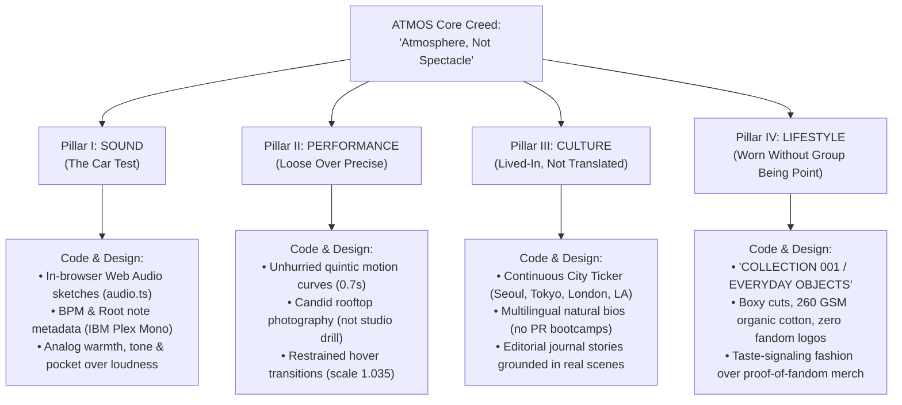
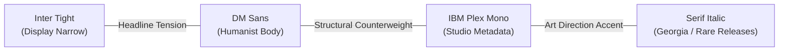

# ATMOS Design Canon & Agent Directives

> **Project:** ATMOS — Independent Music & Culture House (Seoul)  
> **Core Creed:** *"Atmosphere, Not Spectacle."*  
> **Target Aesthetic:** High-End Editorial Print meets Architectural Minimalism  

This document serves as the permanent design memory, art direction philosophy, copywriting voice, and engineering directive for ATMOS. Any AI agent, designer, or engineer contributing to this codebase must study and strictly adhere to these principles.

---

## 1. The Core Creed & Cultural Thesis

### The Premise: Meeting the World Where It Stands
K-pop has historically been *exported* — built in one rigid system and sent outward, asking the global audience to adapt to comeback calendars, intense fandom rituals, choreography-dependent songs, and proof-of-fandom gear. Attempts at "globalizing" have mostly been repackaged casting (KATSEYE, XG).

**ATMOS answers a fundamentally different question:**
> *"What if K-pop met the world where it already stands, instead of asking the world to stand where K-pop is?"*

ATMOS is built from the ground up to feel **native, not translated**, in Seoul, Tokyo, London, California, and Bangkok simultaneously. It trades away idol-system predictability in exchange for authentic cultural residency.

### Rejecting "AI Slop"
Most AI-generated front-ends fall into the trap of generic digital cliches:
- Saturated purple/blue neon glows on generic dark backgrounds.
- Bloated cards with heavy drop shadows (`shadow-2xl`) and round pill containers (`rounded-2xl`).
- Symmetrical, uninspired 3-column card layouts with generic Lucide icon badges.
- Excessive, dizzying hover animations with bouncy springs.

**ATMOS rejects all of this.**  
ATMOS is built like a physical, museum-grade monograph or an independent Seoul fashion/music publication:
- **Restraint Over Noise:** White space is active structural material, not empty gap.
- **Physical Print Warmth:** Everything feels printed on tactile, heavy-stock paper rather than glowing on a generic OLED screen.
- **Architectural Crispness:** Sharp rectangular planes, hairline ink rules, and deliberate asymmetry create tension and prestige.

---

## 2. The Four Pillars Mapped to Code & Art Direction



### Pillar I. Sound — Built to Pass the Car Test
- **The Philosophy:** The song must survive with nothing else attached. No choreo to fill the gaps, no visual lore carrying an underwritten hook. If it shuffle-plays between Tems and Dominic Fike, does it groove?
- **How It Manifests in Code:**
  - Releases feature procedural Web Audio synthesizer previews (`src/lib/audio.ts`) with distinct BPM (e.g. 108 BPM UK garage, 88 BPM soul) and root frequencies.
  - The UI treats music like a vinyl record store, displaying track timing, release type (`EP` / `Single`), and musical metadata with clinical monospaced dignity.

### Pillar II. Performance — Loose Over Precise
- **The Philosophy:** "Precision exists to be watched... look at the machine work. Loose performance communicates something else: *this feels good to move to.* That's a party, not a broadcast."
- **How It Manifests in Code:**
  - Imagery avoids hyper-staged, synchronized idol formations. Photos are candid rooftop shots, late studio conversations, and natural daylight captures (`atmos-hero.jpg`, `artist-june.jpg`).
  - Animations are languid and grounded: `cubic-bezier(0.22, 1, 0.36, 1)`, taking a patient 0.7s to 0.8s to glide.

### Pillar III. Culture — Lived-In, Not Translated
- **The Philosophy:** Not one global asset repackaged for five markets. Real fluency in several scenes at once, carried by people who actually live there.
- **How It Manifests in Code:**
  - The City Band marquee (`.city-band`) continuously tracks real-time atmospheric coordinates across Seoul, Tokyo, London, New York, and Los Angeles.
  - The editorial stories (`#stories`) focus on local subcultures: mixing desks in underground Seoul, long California summers, Bangkok night markets.

### Pillar IV. Lifestyle — Worn Without the Group Being the Point
- **The Philosophy:** **Not Merch.** Fandom merch is proof-of-fandom gear (value only exists inside knowing the group). Lifestyle is taste-signaling (value exists whether or not the wearer has ever heard the music).
- **The Ultimate Test:** *"Does the piece get complimented by someone who doesn't know who the group is?"*
- **How It Manifests in Code:**
  - The apparel section is called `COLLECTION 001 / EVERYDAY OBJECTS`, not "Official SORA Merchandise".
  - Copy emphasizes cut, weight, and silhouette: *"100% organic cotton, 260 GSM. Relaxed, boxy fit with dropped shoulders. Cut to feel like it has always been yours."*
  - Zero idol face prints, zero fandom slogans. Pure, elevated streetwear minimalism.

---

## 3. Copywriting Canon & House Voice

The tone of ATMOS is **the antithesis of hype marketing**. Follow these rules whenever writing text for ATMOS:

| K-Pop / Hype Marketing Slop (FORBIDDEN) | ATMOS House Voice (MANDATORY) |
| :--- | :--- |
| "OMG! Stream the brand new MV now!" | "Sound. Culture. Everywhere." |
| "Join the fandom, buy your official lightstick!" | "Atmosphere, not spectacle." |
| "Check out SORA's groundbreaking comeback era!" | "Five different paths, crossing in one room." |
| "Limited edition idol merchandise drop!" | "The Everyday Tee. Cut to feel like it has always been yours." |
| "Don't miss our exclusive newsletter updates!!!" | "New music. Good things. No unnecessary noise." |

### Copywriting Rules:
1. **Never use exclamation marks (`!`)** in editorial body copy or headlines. Exclamation is replaced by typographic scale.
2. **Short, declarative, poetic sentences**: *"A soft voice. A lasting impression."* / *"Not perfectly in sync. Perfectly in the pocket."*
3. **No corporate speak or idol jargon**: Avoid words like "comeback", "bias", "fandom", "era", "trainee", "showcase". Use "release", "studio", "roster", "collection", "voices".

---

## 4. Color System: Organic Tonal Architecture

ATMOS does not use generic digital white (`#FFFFFF`) or pure pitch black (`#000000`). Its palette is grounded in warm, organic, and earth-derived tones:

| Token | Hex Value | Semantic Role & Psychology |
| :--- | :--- | :--- |
| `--color-paper` | `#f2f1e9` | Primary canvas. A warm, tactile, unbleached newsprint/linen off-white. It eliminates eye strain and establishes immediate editorial credibility. |
| `--color-ink` | `#20221e` | Primary text and solid CTA buttons. Deep charcoal with an olive/earth undertone. It behaves like heavy printer's ink rather than harsh digital pixels. |
| `--color-citron` | `#e4ecaa` | Accent & energy highlight. An electric, pale acid-citron lime. Used sparingly for interactive hovers, text selection (`::selection`), active release state, and full-bleed culture callouts. |
| `--line` | `#20221e30` / `#20221e0d` | Hairline editorial dividers. Ultra-subtle ink rules (10% to 20% opacity) that partition content like grid lines in an architectural drawing. |
| `--color-muted` | `#6b6f62` / `#8b8f97` | Secondary copy, photographer credits, and quiet studio metadata. |

### Atmospheric Room Shifts (Sectional Palette Shifting)
1. **Hero Room (`#5f6b6a` + photographic depth):** Atmospheric dawn fog with gradient scrim.
2. **Collection Room (`var(--color-paper)`):** Crisp daylight gallery floor.
3. **Artists Showcase (`#e7e8df`):** A slightly cooler concrete/linen plaster gallery wall.
4. **Releases Room (`#1d201b`):** A dark, subterranean listening room where typography reverses to paper on ink and citron glows.
5. **House Manifesto (`var(--color-citron)`):** A sudden, vibrant blast of electric energy that re-energizes the reader before the footer.

---

## 5. Typographic Triad & Extreme Scale Tension



### 1. Inter Tight (Display / Headline)
- **Role:** Commanding, poster-scale titles.
- **Characteristics:** Tight vertical proportion, narrow set width, heavy tracking compaction (`letter-spacing: -0.035em` to `-0.055em`), and ultra-tight line height (`line-height: 0.81` to `1.05`).
- **Usage:** Never use for paragraphs. Reserved for hero statements, artist names, and section headlines.

### 2. DM Sans (Humanist Body & Actions)
- **Role:** Editorial storytelling, product descriptions, dialog bodies, buttons.
- **Characteristics:** Generous, warm, open counters, high legibility, unhurried line-height (`1.7` to `1.9`).

### 3. IBM Plex Mono (Technical Studio Metadata)
- **Role:** City ticker, track timecodes, collection codes (`COLLECTION 001 / EVERYDAY OBJECTS`), garment dimensions, release dates.
- **Characteristics:** Monospaced precision, small font sizes (7px to 10px), wide tracking (`letter-spacing: 0.07em` to `0.12em`), uppercase (`text-transform: uppercase`).

### 4. Extreme Scale Contrast (Macro meets Micro)
ATMOS creates drama by placing monumental typography right next to delicate, miniature metadata:
- Huge 90px+ headlines directly paired with 8px uppercase monospaced labels (`.eyebrow`, `.micro`).
- No mid-tier mush: either typography is commanding and monumental, or it is tiny, precise, and understated.

---

## 6. Layout & Grid Composition: Asymmetrical Tension

Symmetrical layouts feel static and algorithmic. ATMOS uses intentional **asymmetry** to guide the eye and grant visual weight to lead elements:

- **Apparel Grid:** `grid-template-columns: 1.15fr 1fr 1fr;`  
  The first campaign look is intentionally wider than the secondary product objects.
- **Artist Roster:** `grid-template-columns: 2.15fr 1fr 1fr;`  
  The flagship group (SORA) commands more than double the horizontal real estate of solo artists.
- **Footer Navigation:** `grid-template-columns: 2fr 1fr 1fr 1.1fr;`  
  The brand purpose statement holds deep breathing space before the column links unfold.
- **Fluid Proportions:** All margins, paddings, and font sizes use mathematical fluid clamps rather than rigid media query jumps:
  ```css
  --page-gutter: clamp(24px, 3.45vw, 72px);
  font-size: clamp(39px, 3.75vw, 64px);
  ```

---

## 7. Architectural Restraint & Shape Language

- **Zero Container Border Radius:**
  ```css
  button, input, select, textarea { border-radius: 0; }
  ```
  Containers, image frames, and input fields never have soft rounded corners. They meet the page at sharp 90-degree right angles, evoking architectural blueprints and printed editorial spreads.
- **The Circular Micro-Anchor Counterweight:**
  To counterbalance the razor-sharp rectangles, micro-action touchpoints are rendered as pristine 50% circular pills:
  - Quick-add trigger (`37px x 37px`, `border-radius: 50%`)
  - Artist profile arrow (`40px x 40px`, `border-radius: 50%`)
  - Release play button (`47px x 47px`, `border-radius: 50%`)
  - Dialog close button (`border-radius: 50%`)
- **Zero Drop-Shadow Clutter:**
  No cards cast diffuse digital shadows. Elevation is achieved purely through color contrast, borders, and layered planar overlap. The only shadows in the entire system are subtle, tinted atmospheric dialog scuffs (`box-shadow: 0 15px 100px #00000026;`).

---

## 8. Micro-Interactions & Choreographed Motion

Motion in ATMOS is restrained, physical, and unhurried:

- **The Governing Ease Curve:**
  ```css
  transition: transform 0.7s cubic-bezier(0.22, 1, 0.36, 1);
  ```
  A custom quintic deceleration curve. It accelerates briskly and glides to a stop like a luxury physical drawer.
- **Micro-Hover Transformations:**
  - **Image zoom:** Subtle and disciplined (`transform: scale(1.035)` to `scale(1.045)`). Never aggressive.
  - **Diagonal arrow drift:** External link indicators shift subtly up and right (`transform: translate(3px, -3px)`).
  - **Circular action triggers:** On hover, rotate 90 degrees and fill with citron accent:
    ```css
    .product-preview-button:hover .quick-add {
      transform: rotate(90deg);
      background: var(--color-citron);
    }
    ```
- **Quiet Header:**
  The navigation header is sticky, slim (80px), and has a faint hairline border (`#20221e0d`). It stays completely out of the way, allowing the campaign hero imagery to dominate.
- **Reduced Motion Respect:**
  Every Motion component and CSS animation respects `prefers-reduced-motion: reduce`, dropping transitions to zero or minimal fades.

---

## 9. Directives for Future Agents & Engineers

When adding new pages, dialogs, features, or components to ATMOS, follow these immutable rules:

### DO:
1. **Always use `--color-paper` (`#f2f1e9`) and `--color-ink` (`#20221e`)** as your foundational contrast pair.
2. **Use `IBM Plex Mono` for all metadata, counters, timecodes, and eyebrows**, styled uppercase with wide tracking (`0.07em`).
3. **Use `Inter Tight` with tight negative tracking (`-0.035em` to `-0.05em`)** for display titles.
4. **Use `clamp()` for responsive layout and typography** so the experience feels continuous from 320px mobile to 2560px ultra-wide displays.
5. **Keep containers flat with 0 border-radius**, using 1px hairline rules (`var(--line)`) for structure.
6. **Provide keyboard accessibility and focus trapping** for all overlay dialogs.
7. **Write copy that is unhurried, evocative, and devoid of exclamation marks or idol hype.**

### DO NOT:
1. **DO NOT use generic rounded cards (`rounded-lg`, `rounded-2xl`)** or Tailwind drop-shadow utilities (`shadow-lg`, `shadow-xl`).
2. **DO NOT add gradient borders, neon glowing buttons, or glassmorphic blur overlays** unless explicitly instructed.
3. **DO NOT create symmetrical, boring 3-column card layouts** without first considering visual hierarchy and editorial scale.
4. **DO NOT use pure white (`#fff`) or pure black (`#000`)**; always respect the tactile paper and ink palette.
5. **DO NOT add unrequested decorative badges, counters, chips, or pill wrappers.**
6. **DO NOT introduce new font families** outside the established triad (`Inter Tight`, `DM Sans`, `IBM Plex Mono`).
7. **DO NOT use K-pop fandom jargon** ("comeback era", "lightsticks", "stanning", "fandom perks", "bias"). ATMOS is a culture house, not an idol factory.
