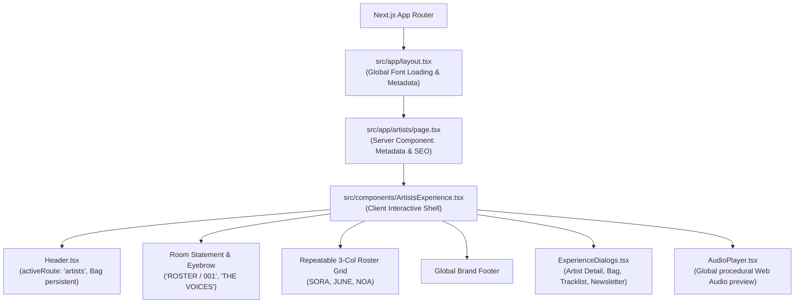

# Design Specification: ATMOS Dedicated Artists Room (`/artists`)

> **Date:** 2026-09-23  
> **Route:** `/artists`  
> **Aesthetic Canon:** `AGENTS.md` (High-End Editorial Print meets Architectural Minimalism)  
> **Status:** Approved by Eds  

---

## 1. Thesis & Mental Model

The `/artists` room presents the creative roster of ATMOS—an independent Seoul music and culture house. Unlike conventional K-pop agency directories that feature hyper-polished idol headshots, trainee badges, or comeback schedules, ATMOS presents artists with museum-grade editorial dignity:

1. **Progressive Disclosure Over Main Scroll Clutter**:
   The root page is calm, spacious, and scannable. It does not dump extensive interviews or discographies onto the top-level scroll. Instead, each artist is framed with a candid editorial portrait, residency coordinates, and a quiet poetic tagline. Deep biographical context and track previews live inside the contextual **Artist Detail Modal**.
2. **N-Artist Scalability**:
   The catalog uses an uncompromised, fluid, repeatable 3-column grid (`repeat(3, minmax(0, 1fr))` on desktop, 2-column on tablet, 1-column on mobile). Whether the roster has 3 artists or 30, the layout remains balanced without custom asymmetric overrides.
3. **Quiet Confidence (Zero Funnel Banners)**:
   No aggressive callouts or marketing banners at the bottom. Visitors transition naturally between rooms via the global header and footer.

---

## 2. Information Architecture & Routing

---

## 3. Visual Layout Anatomy

### A. Room Header
- **Eyebrow:** `ROSTER / 001` (`IBM Plex Mono`, 8px, uppercase, tracking `0.1em`).
- **Headline:** `THE VOICES` (`Inter Tight`, display scale clamp, tight tracking `-0.04em`, no exclamation marks).
- **House Statement:** *"Not assembled by algorithm. Rooted in cities, crossing in one room."* (`DM Sans`, muted tone `#6b6f62`).

### B. Scalable Roster Grid (`.artists-directory-grid`)
- **Grid Rule:** `grid-template-columns: repeat(3, minmax(0, 1fr));` with responsive breakpoints (2 cols @ 980px, 1 col @ 640px).
- **Card Elements:**
  - **Index & Coordinates:** `[01]` `SEOUL / EVERYWHERE` in monospaced precision.
  - **Portrait Frame:** 4:5 aspect ratio, candid daylight/rooftop photography with zero container border radius.
  - **Hover Motion:** Unhurried ease `cubic-bezier(0.22, 1, 0.36, 1)`, scale `1.035`.
  - **Artist Name:** Poster-scale `Inter Tight` with sharp ink contrast.
  - **Poetic Summary:** Unhurried `DM Sans` humanist typography.
  - **Circular Action Anchor:** 40px circular trigger (`border: 1px solid var(--line)`), transitioning to `--color-citron` on hover, opening the artist modal or triggering preview playback.

### C. Progressive Disclosure: Contextual Artist Dialog
- Leveraging the existing `ExperienceDialogs.tsx` modal system.
- Full bio, vocal tone notes, primary release connection, and Web Audio synthesis preview trigger.

---

## 4. Design Canon Compliance Checklist (`AGENTS.md`)

- [x] **Palette:** `--color-paper` (`#f2f1e9`) background, `--color-ink` (`#20221e`) typography, hairline ink borders.
- [x] **Typography:** `Inter Tight` (Display titles), `DM Sans` (Taglines & descriptions), `IBM Plex Mono` (Coordinates, indexes).
- [x] **Zero Container Radius:** Sharp 90-degree right angles on cards and image frames.
- [x] **Circular Touchpoints:** Pristine 40px circular action buttons for interaction balance.
- [x] **Zero Hype / Zero Exclamations:** Poetic, declarative copy only.
- [x] **Sound Engine Integration:** Seamless audio preview playback via docked `AudioPlayer`.
- [x] **Client Hydration Safety:** Proper hydration guards for local state and Web Audio.
